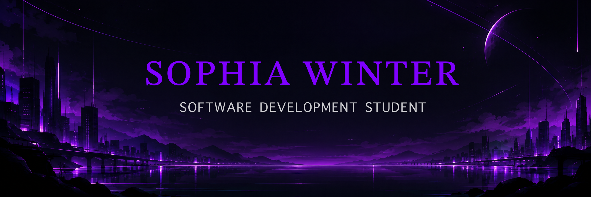

  

###

  

###

  

###

Hi, I'm Sophia!

###

###

I’m currently a software development student (Fachinformatikerin für Anwendungsentwicklung). For me, coding is the perfect outlet for my love of logic and order—there is something incredibly satisfying about bringing structure to complex problems and making things run efficiently.  Right now, I’m fully focused on absorbing as much knowledge as possible, mastering the core principles of software engineering, and turning theory into hands-on projects. While I’m keeping an open mind about where exactly I want to specialize in the future, my main goal right now is to build a solid foundation and see where this exciting journey takes me.

###

  

###

 

  

###

 

  

###

  
  
  
  
  
  
  
  
  
  
  
  
  

###

 

  

###

 

  

###

  
  
  

###

 

  

###

<h3 data-importer="text" align="center">six-eyes:active</h3>

###

<h4 data-importer="text" align="center">I don't need a linter. My Six Eyes spot the syntax errors instantly. Nothing escapes my sight.</h4>

###

  

###

 

  

###

 

<picture data-importer="pacman">
  <source media="(prefers-color-scheme: dark)" srcset="https://raw.githubusercontent.com/SophiaWinterDev/SophiaWinterDev/pacman-output/galaga-contribution-graph-dark.svg?game=galaga">
  <source media="(prefers-color-scheme: light)" srcset="https://raw.githubusercontent.com/SophiaWinterDev/SophiaWinterDev/pacman-output/galaga-contribution-graph.svg?game=galaga">
  
</picture>

###
